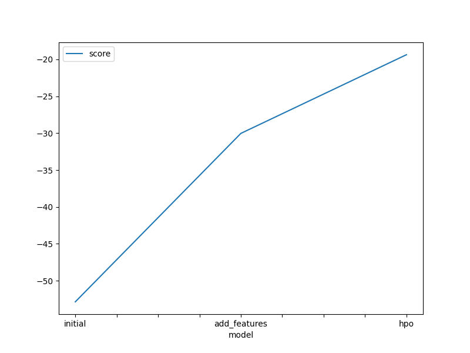
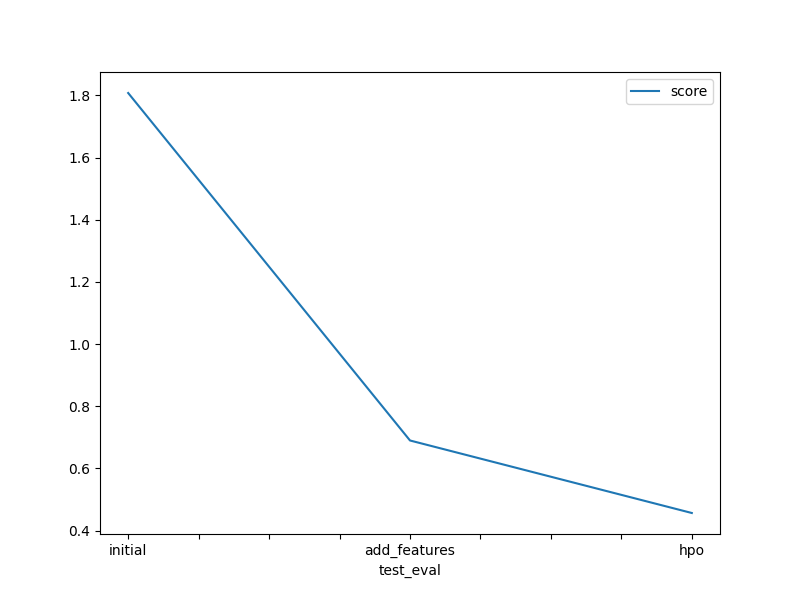

# Report: Predict Bike Sharing Demand with AutoGluon Solution
#### Sam Chong

## Initial Training
### What did you realize when you tried to submit your predictions? What changes were needed to the output of the predictor to submit your results?
I did not have any problems submitting the initial predictions. None of the predicted counts were less than zero.

### What was the top ranked model that performed?
WeightedEnsemble_L3

## Exploratory data analysis and feature creation
### What did the exploratory analysis find and how did you add additional features?
- The data is approximately uniformly distributed across the time period when this is considered over the full number of years.
- The season feature appears to be discrete categorial data and the data is evenly distributed between the categories
- The data for temperature and "feels like" temperature has an approximately Gaussian distribution
- The weather feature appears to be in discrete categories and there is a highly uneven distribution across the categories
- The windspeed data is right skewed: there are fewer data for higher windspeeds
- There are very few data for holidays compared to non-holidays
- There are more data for working days than weekends; presumably approximately 5:2

A time-related feature was added by extracting the hour from the "datetime" column of each row.

### How much better did your model perform after adding additional features and why do you think that is?
The model performed far better after adding the "hour" feature and converting the "season" and "weather" features to categories. The Kaggle score
dropped by approximately 62 %.

The "hour" feature provided additional granularity when considering the time series. When the time was considered over the years-long
period, the detail in variations across shorter time periods is lost.

## Hyper parameter tuning
### How much better did your model perform after trying different hyper parameters?
The hyperparameter tuning reduced the Kaggle score from 0.69008 to 0.45683 (approx. 34 % lower). The improvement appears somewhat 
counterintuitive, as the fit was performed using a "lower quality" set of hyperparameters from the "good_quality" preset rather than
the "best_quality" used for the first two models. A time limit was also set, so it could more models could be generated and optimised 
in the time, rather than spent training individual models. Alternatively, as a different evaluation metric was used, it may be that this
was the primary factor in the improved model performance.

### If you were given more time with this dataset, where do you think you would spend more time?
I would perform additional EDA to look at potential correlations between features in the dataset and with the target, using scatterplots and correlation matrices. I would also 
look more carefully at the distributions of the data, e.g. to look for outliers. 

Given that the feature engineering had a significant effect on the model performance, I would also spend more time on this part of the process; for example, by including 
other time periods, such as months of the year.

EDA showed that the data is imbalanced with respect to several features. This could have an impact on the reliability of inferences for poorly represented cases. It should be considered how this could be addressed.

Once an appropriate set of features had been assembled, a regression model could be used as an initial baseline model. Hyperparameter tuning could be looked at again. There are many possible options, and making use of AutoML to optimise the hyperparameters of promising models would be interesting. 

As an aside, I would also look again at the impact of the evaulation metric, for example, by re-running the fitting with the "good_quality" and the RMSE metric to give a direct comparison with the two earlier models, the separate the effects of the metric and the model presets.

### Create a table with the models you ran, the hyperparameters modified, and the kaggle score.
|model|eval_metric|preset|refit_full|set_best_to_refit_full|_save_bag_folds|score|
|---|---|---|---|---|---|---|
|initial|RMSE|best_quality|False|False|False|1.80702|
|add_features|RMSE|best_quality|False|False|False|0.69008|
|hpo|MAE|good_quality|True|True|True|0.45683|

The "best_quality" and "good_quality" presets use different configurations for the model hyperparameters, with the
former using the default set and the latter using the "light" configuration. These configurations differ in the 
"max_depth" hyperparameter allowed for RandomForest and ExtraTrees models.

### Create a line plot showing the top model score for the three (or more) training runs during the project.

The plot of the model score shows that the error becomes closer to zero after the addition of the additional "hour" feature
and categorisation of the season and weather. The error is further reduced after hyperparamter optimisation. However, the evaluation
metric for the hyperparameter optimisation step is different (it uses mean absolute error rather than root mean square error that was
used for the first two models).

### Create a line plot showing the top kaggle score for the three (or more) prediction submissions during the project.

## Summary
In this project, I used AutoML using AutoGluon to predict the demand for Bike Sharing. EDA was used to visualise the distribution of the data.
Feature engineering had a significant impact on the performance of the model. Including a more granular time feature improved the Kaggle score by ~62%. If I was working on this problem further, I would focus my initial efforts on further EDA and feature engineering before developing a baseline model. More complex models and hyperparameter tuning could then improve the more promising models.

